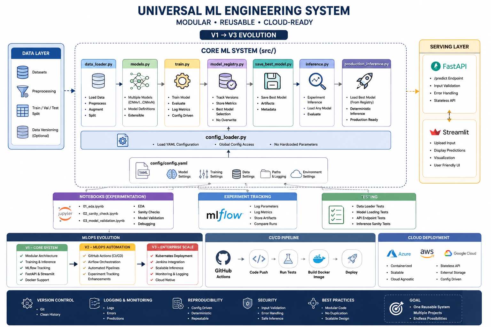

# Machine Learning Engineering System

## 🏗️ Architecture Diagram



## 🚀 Project Overview

This project implements a **modular Machine Learning Engineering system** designed to be:

- Reusable across multiple ML projects (ML + NLP, Computer Vision)
- Cloud-ready (Azure, AWS, GCP)
- Fully containerized and production-oriented
- Structured using MLOps best practices

The system evolves through a **single reusable architecture template (V1 → V3)**, ensuring scalability without redesigning the core system for every new project.

---
## 🎯 Project Purpose

The purpose of this project is to demonstrate a **real-world Machine Learning Engineering pipeline**, including:

- Modular ML architecture design
- Model experimentation and versioning
- Reproducible training pipelines
- Production-ready inference system
- Deployment-ready API and UI services

This project is part of a larger roadmap to build **6 end-to-end ML systems (3 NLP + 3 CV)** using a unified architecture template.

---

## 🧠 Key Concept: Universal ML System Template

This project is built on a **single evolving architecture template**, where the core system structure remains constant while capabilities are progressively extended.

- **V1 → Core ML System (foundation):** modular training, inference, and model registry  
- **V2 → MLOps layer:** automation, experiment tracking, and CI/CD integration  
- **V3 → Enterprise + cloud-scale system:** containerization, orchestration, and distributed deployment  

---

## 🧠 Core System Principles 

This system enforces strict separation of concerns:

- Training ≠ Inference
- Registry ≠ Runtime system
- Notebooks ≠ Production code
- UI ≠ ML logic
- MLflow ≠ Inference dependency

---

# 🏗️ Architecture Overview

## 📦 High-Level System Design

The system follows a **modular pipeline architecture**, separating experimentation, training, and production inference.

```
                    ┌──────────────────────┐
                    │    notebooks/        │
                    │ (EDA + validation)   │
                    └─────────┬────────────┘
                              │
                              ▼
        ┌────────────────────────────────────────┐
        │              src/                      │
        │----------------------------------------│
        │ data_loader.py         → Data pipeline │
        │ models.py              → Model defs    │
        │ train.py               → Training      │
        │ inference.py           → Testing       │
        │ production_inference.py→ Production    │
        │ model_registry.py      → Versioning    │
        │ save_best_model.py     → Persistence   │
        │ config_loader.py       → Config system │
        └──────────────┬─────────────────────────┘
                       │
                       ▼
        ┌────────────────────────────────────────┐
        │            API Layer                   │
        │        FastAPI /predict               │
        └──────────────┬─────────────────────────┘
                       │
                       ▼
        ┌────────────────────────────────────────┐
        │             UI Layer                  │
        │        Streamlit Interface           │
        └────────────────────────────────────────┘
```

## 🔁 System Flow

- notebooks → experimentation and validation only  
- src → training + inference logic (core system)  
- API → production inference endpoint  
- UI → optional user interaction layer  

---

## ⚙️ Configuration System

The entire system is fully driven by a centralized YAML configuration file, designed as a **reusable schema rather than a fixed configuration**.

This ensures that the same architecture can be applied across different ML domains (Computer Vision, NLP, tabular ML) without modifying core code.

```yaml
model:
  name: Model_v1  # Example only (varies per project: Model_v1, Model_v2, etc.)

training:
  batch_size: 64
  epochs: 20
  learning_rate: 0.001

data:
  dataset: dataset_name  # Example only (project-dependent)
  split: [0.7, 0.15, 0.15]

paths:
  model_dir: models/
  log_dir: logs/
```

### 🧠 Design Guarantees

- Configuration is treated as a **schema that adapts per project**
- No hardcoded hyperparameters anywhere in the codebase  
- Fully reproducible experiments driven entirely by YAML configuration  
- Same system architecture supports different models and datasets without code changes  

---

## 🧪 Model Experimentation Strategy

The system supports **multiple versioned models**, independent of architecture type (CNN, Transformer, XGBoost, etc.).

- Model versions follow a generic naming convention (e.g., Model_v1, Model_v2, Model_v3)
- No previous model is ever overwritten
- All experiments are tracked through a centralized model registry

### 📊 Model Registry Tracks

- Model version  
- Evaluation metrics (accuracy, loss, etc.)  
- Best model selection flag  
- Training metadata (hyperparameters, config snapshot)

---

## 🧠 Training Pipeline Rules

The training pipeline is designed to be **fully reproducible and configuration-driven**, ensuring consistent results across environments.

- Training is fully controlled via `config.yaml`
- `train.py` maintains a **stable interface contract** (no logic variations per experiment)
- Model selection is handled exclusively through configuration
- All training runs are deterministic when using the same configuration and seed

### 📊 Tracking

- Metrics are logged for every run
- Each experiment is traceable through configuration + metadata
- No hidden hyperparameters or runtime overrides

---

## 📒 Notebook Layer (Experimentation Only)

The notebook layer is used strictly for **controlled experimentation, validation, and debugging support**, not for production logic.

### 🧩 Allowed Use Cases

- Data exploration (EDA)
- Model sanity checks
- Validation of predictions
- Debugging pipeline behavior
- Cross-checking training results

---

### 🧠 Critical Design Rule

All notebook evaluations must use the **same preprocessing, model loading, and inference logic as the production system**.

This ensures:

- Consistency between training, inference, and evaluation results  
- No divergence between notebook metrics and production metrics  
- No duplicated or modified logic inside notebooks  
- Reliable verification of model performance  

---

### 📁 Notebook Structure


```
notebooks/
  ├── 01_eda.ipynb
  ├── 02_sanity_check.ipynb
  ├── 03_model_validation.ipynb
```

---

## 🌐 API Layer (Production Inference)

The API layer is built using **FastAPI** and provides a stateless production interface for model inference.

### 📡 Endpoint

- `/predict` → handles inference requests

### 🧩 Responsibilities

- Input validation and request schema enforcement  
- Stateless inference execution  
- Loads **frozen trained model artifacts (.pt files)**  
- Ensures inference logic is fully isolated from training codebase  

### 🧠 Design Principle

- The API does NOT depend on training logic  
- Model selection is resolved externally (via configuration or registry metadata), but inference always uses a fixed, frozen model artifact  

---

## 🎛️ UI Layer (Optional)

The UI layer is a **presentation and interaction layer** that enables users to interact with the ML system without modifying the core pipeline.

### 🧠 Core Purpose (Tool-Agnostic)

- Provides a human-facing interface for model inference
- Enables input submission (image, text, or structured data)
- Displays model predictions and outputs in a user-friendly format
- Acts as a **decoupled layer from the ML system**

### 🧠 Design Principle

- The UI layer is **fully optional**
- It is **not part of the ML core system**
- It can be replaced or removed without affecting training, inference, or API layers
- It does NOT contain ML logic

---

### 🛠️ Possible Implementations

The UI layer can be implemented using different technologies depending on the project:

- Streamlit (fast prototyping, Python-based dashboards)
- Gradio (lightweight ML demos)
- Dash (data-focused applications)
- React / Next.js (production-grade web applications)
- Or no UI at all (API-only systems)

---

### 🎛️ Example Implementation (Streamlit)

Built with **Streamlit** as a lightweight interface:

- Image upload interface for inference testing  
- On-demand prediction requests (non-streaming)  
- Visualization of model outputs and results  

### 🧠 Streamlit Design Principle

- The UI is **optional and decoupled from the ML system**
- It does not contain training or inference logic
- It can be removed without affecting the backend system

---

## 🐳 Containerization

The system is designed to be **container-first and environment-independent**, ensuring reproducibility across development, testing, and production environments.

### 🧩 Container Strategy

- API service is containerized for production deployment  
- UI layer can be optionally containerized depending on the use case  
- Each service runs in an isolated environment to ensure consistency  
- The system is independent of local machine configuration  

### 🧠 Design Principles

- Reproducibility across environments is guaranteed via Docker  
- The system is **stateless at runtime** (no local dependencies required)  
- Containers encapsulate all dependencies and runtime configurations  
- Supports deployment across cloud platforms (Azure, AWS, GCP)

---

## 🔁 Model Registry

The model registry is a **central governance system for model versioning, evaluation tracking, and selection management**.

### 🧩 Responsibilities

- Tracks all trained model versions (e.g., Model_v1, Model_v2, etc.)  
- Stores evaluation metrics (accuracy, loss, F1-score, etc.)  
- Maintains metadata for each training run (configuration snapshot, timestamp, parameters)  
- Identifies and flags the best-performing model based on predefined selection criteria  

### 🧠 Design Principle

- No model is ever overwritten or lost  
- The registry does NOT store model weights for inference  
- It serves as a **selection and tracking layer only**, not a runtime dependency  

### 📌 System Guarantee

- Inference always uses **frozen model artifacts (.pt files)**  
- The registry defines *which model is best*, but does not execute models  

---

## 🧪 Testing Strategy

The system includes a structured testing layer designed to ensure **reproducibility, stability, and correctness across all ML pipeline components**.

### 🧩 Test Coverage

- Unit tests for data loading and preprocessing modules  
- Validation tests for model loading from frozen artifacts (.pt files)  
- API endpoint tests for `/predict` functionality (FastAPI)  
- Inference sanity checks to verify prediction consistency  
- Preprocessing consistency tests between training and inference pipelines  

### 🧠 Design Principle

- Testing ensures that changes in one module do not break the full pipeline  
- The system is validated at multiple levels (unit + integration + sanity checks)  
- Prevents silent failures in data, training, and inference stages  

---

## 📡 Logging & Monitoring

The system includes a structured logging layer to ensure **full traceability, debuggability, and operational visibility** across training and inference workflows.

### 🧩 Logging Coverage

- Training logs (metrics, loss curves, hyperparameters, run metadata)  
- API request logs (inputs, timestamps, response status)  
- Error tracking (exceptions across training and inference pipelines)  
- Prediction logs (model outputs for monitoring and auditability)  

### 🧠 Design Principle

- Logging is **structured and traceable across the full ML lifecycle**  
- Each training run and inference request can be reconstructed from logs  
- Logs support debugging, monitoring, and system validation  
- Enables detection of failures, drift, and unexpected model behavior  

---

## ☁️ Cloud Readiness

The system is designed as a **cloud-agnostic ML architecture**, capable of deployment across major cloud providers without code modification.

### 🌐 Supported Platforms

- Microsoft Azure  
- Amazon Web Services (AWS)  
- Google Cloud Platform (GCP)  

### 🧩 Deployment Principles

- Docker-first architecture ensures consistent environments across all platforms  
- Stateless inference API enables horizontal scaling and independent deployments  
- Externalized configuration allows environment switching (dev / staging / production) without code changes  
- Model artifacts are portable and decoupled from the runtime system  

### 🧠 Design Principle

- Training and inference environments are fully separated  
- The system does not depend on local machine configurations  
- Any cloud provider can run the same system with identical behavior  

---

## 🔄 MLOps Evolution (V1 → V3)

This system evolves through three maturity levels while maintaining a **constant core architecture**. Only capabilities are added — the structure remains unchanged.

---

### 🟢 V1 — Core ML System (Foundation)

Focus: **stable, reproducible ML architecture**

- Modular ML system design (src/ structure)
- Training and inference pipelines
- Experiment tracking (MLflow used ONLY for logging experiments)
- Basic FastAPI + optional Streamlit interface
- Docker support for environment reproducibility

🧠 Goal: Build a correct and reproducible ML system

---

### 🟡 V2 — MLOps Automation Layer

Focus: **automation and workflow orchestration**

- CI/CD pipelines (GitHub Actions)
- Workflow orchestration (Airflow or equivalent)
- Automated training and validation pipelines
- Improved experiment tracking and evaluation workflows

🧠 Goal: Remove manual execution and enforce automation

---

### 🔴 V3 — Enterprise Cloud System

Focus: **scalable and production-grade deployment**

- Kubernetes-based deployment (container orchestration)
- Jenkins or equivalent CI/CD systems
- Fully cloud-native architecture (Azure / AWS / GCP)
- Distributed and scalable inference services
- Stateless microservice-based design

🧠 Goal: Enable scalable, production-ready ML systems across cloud environments

---

## 🧠 Tech Stack

The system is built using a modern Machine Learning Engineering stack designed for **scalability, reproducibility, and production deployment**.

### 🧩 Core ML Stack

- Python  
- PyTorch  
- YAML (configuration-driven system design)  

### 🚀 MLOps & Deployment Stack

- FastAPI (model serving API)  
- Streamlit (optional UI layer)  
- MLflow (experiment tracking only)  
- Docker (containerization and reproducibility)  
- Git (version control and collaboration)  

---


## 📌 Summary

This project defines a **production-style Machine Learning Engineering system template** designed for long-term reuse across NLP, Computer Vision, and cloud-based ML applications.

It provides a **modular and configuration-driven architecture** that scales from local experimentation to full cloud deployment, while maintaining strict consistency, reproducibility, and separation of concerns across all system layers.

---

## 👤 Author

**Alvaro Vega**  
Machine Learning Engineer (Aspiring) | AI Systems Designer | NLP & LLM Engineering Learner  

### 🧠 Project Context

This repository is part of a structured learning path focused on building **production-grade Machine Learning Engineering systems**, including modular ML architecture, MLOps practices, and cloud deployment readiness.

### 🔗 GitHub

https://github.com/Javier-DataScience

---

